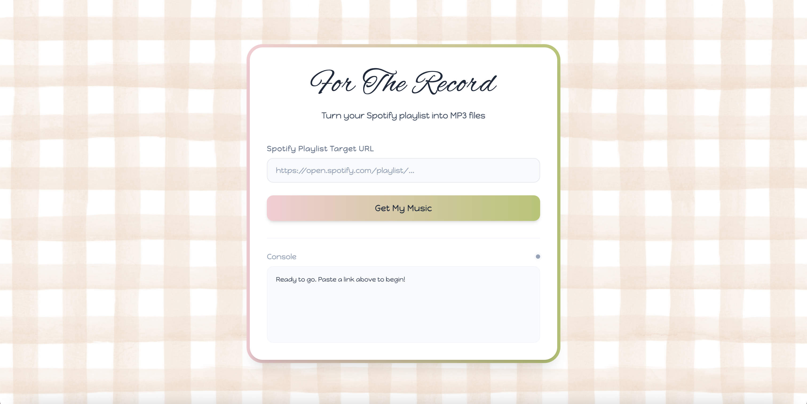

# For The Record

I recently found my dad's old 2000s era iPod Shuffle—the very first generation iPod sold by Apple! Honestly, holding it made me want to connect with the experience my dad had back in those days. I've also been trying to spend a bit more time offline away from my phone, so I decided I actually wanted to start using it. 

The problem is that getting music onto an old iPod in 2026 is a massive pain. You can't just sync a streaming app to it. I wanted a way to turn my favorite Spotify playlists into local MP3 files fast and quickly so I could load them up onto the device. That's why I built this project. I hope you enjoy it!

---

---

## What This Project Does (Features)

*   **Dual Mode Dashboard:** Seamlessly switch between rendering local hardware MP3 configurations or exporting playlists directly into online YouTube assets.
*   **Fast Spotify to MP3 Downloader:** You just paste a Spotify playlist link, and the backend finds the songs, downloads them, and converts them to MP3s automatically.
*   **Audio Compressing (iPod Shuffle-Squeezer):** Old iPods don't have much storage space. The code automatically shrinks the music files down to a 128kbps variable bitrate so you can fit way more songs onto the limited hardware.
*   **Hardware Metadata Tagging:** Older Apple hardware won't show song details properly if the file is just raw audio. My script injects the actual song title, artist name, album name, and even the cover artwork directly into the file's binary metadata frames.
*   **Smart Database Cache:** To make things fast and stop me from hitting API rate limits, the app tracks what it has already downloaded inside a local SQLite database (`cache.db`). If you run a playlist twice, it won't waste time downloading the same song again—it just grabs it instantly from the local cache.
*   **Spotify to YouTube Engine:** Under the hood, the backend takes your Spotify playlist and uses fuzzy text matching to find the absolute best matched music video or audio track on YouTube before pulling it down, effectively mapping a Spotify list over to YouTube assets.
*   **Auto USB Mount Detection:** I wrote a helper script that scans your computer's drive ports. If your USB or iPod is plugged in, it tries to detect it and create the sync folders right on the drive.

---

## How to Set Up and Use the Project

### Prerequisites
You need to have Python installed on your machine. You will also need FFmpeg installed on your computer for the audio extraction and conversion to work properly.

### 1. Install Dependencies
Open your terminal and run the following command to get all the required libraries installed:
```bash
pip install -r backend/requirements.txt
```

### 2. Boot Up the Backend Server
Run the Flask server script to get the backend API running and listening for requests:

```bash
python backend/app.py
```
### 3. Open the Frontend Dashboard
To use the app, just open the `frontend/index.html` file in any regular web browser.

### 4. Sync Your Music
* Toggle your sync method at the top of the interface by choosing either "get mp3 files" or "make youtube playlist".
* **Paste your Spotify playlist URL** into the input text box on the screen.
* Click the **"Get My Music"** (or **"Make Playlist"**) button.
* **Watch the Console log box** at the bottom of the page print out the live progress indicator as it queries, matches, downloads, compresses, and tags your tracks.
* Once it finishes and the status indicator transitions out of its processing state, check your local fallback path at `backend/iPod_Music_Local/` (or your automatically detected physical hardware partition mount) to find your freshly minted MP3 files!
